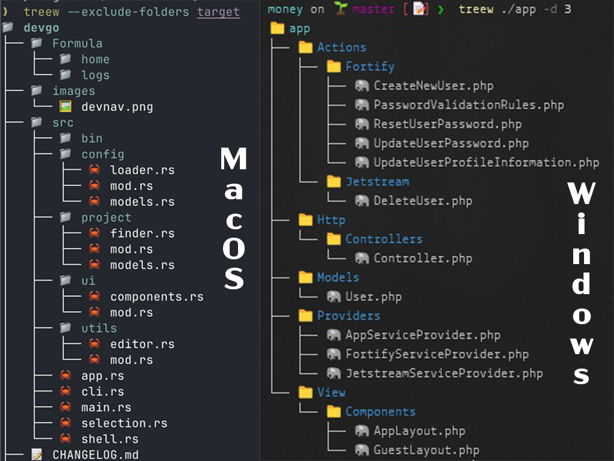

# 🌲 Treew

Una herramienta de línea de comandos para visualizar árboles de directorios con íconos y opciones de formato. Treew mejora la visualización tradicional con íconos por tipo de archivo, información de tamaño y varias opciones de formato para hacer la exploración de directorios más intuitiva y visualmente atractiva.



## ✨ Características

- 📁 Muestra la estructura de directorios con íconos intuitivos
- 📏 Muestra tamaños de archivos con formato legible
- 🕒 Muestra fechas de última modificación
- 🔍 Profundidad de recorrido configurable
- 🚫 Excluye carpetas y extensiones específicas
- 💾 Guarda la salida en un archivo
- 👁️ Alternar visibilidad de archivos ocultos
- 🎨 Íconos Unicode para diferentes tipos de archivo
- 🌈 Salida con colores para mejor visualización

## 🚀 Instalación

### Desde los binarios precompilados

1. Ve a la [página de releases](https://github.com/elmersh/treew/releases)
2. Descarga el archivo apropiado para tu sistema operativo y arquitectura
3. Extrae el archivo descargado
4. Ejecuta el script de instalación correspondiente:
   - Para Linux/macOS: `./install.sh`
   - Para Windows: 
     1. Abre PowerShell como administrador
     2. Ejecuta el siguiente comando para permitir la ejecución de scripts:
        ```powershell
        Set-ExecutionPolicy RemoteSigned -Scope CurrentUser
        ```
     3. Navega al directorio donde extrajiste los archivos
     4. Desbloquea el archivo descargado (necesario para archivos descargados de internet):
        ```powershell
        Unblock-File -Path .\install.ps1
        ```
     5. Ejecuta el script de instalación:
        ```powershell
        .\install.ps1
        ```
     6. Reinicia tu terminal para que los cambios surtan efecto

El script de instalación:
- Instala el binario en `/usr/local/bin` (o `~/.local/bin` si no tienes permisos)
- Crea un archivo de configuración predeterminado en `~/.config/treew.yaml`
- Añade automáticamente el directorio de instalación a tu PATH si es necesario
- Configura los permisos de ejecución correctamente

### Desde el código fuente

```bash
# Clonar el repositorio
git clone https://github.com/elmersh/treew
cd treew

# Compilar e instalar
go install
```

## 📖 Uso

### Ejemplos básicos

```bash
# Árbol de directorios básico
treew

# Especificar una ruta
treew /ruta/a/tu/directorio

# Mostrar con tamaños de archivo
treew --show-file-size
# o con el alias corto
treew -s

# Mostrar con fechas de última modificación
treew --modified
# o con el alias corto
treew -m
```

### Ejemplos avanzados

```bash
# Excluir múltiples carpetas y mostrar archivos ocultos
treew -f node_modules,bin,.git --show-hidden

# Limitar profundidad y guardar en archivo
treew --max-depth 3 --output-file tree.txt

# Combinar múltiples opciones
treew --show-file-size -m -f node_modules,bin -e .exe,.dll --max-depth 2
```

### Guardar configuración personalizada

```bash
# Guardar la configuración actual como predeterminada
treew -f node_modules,bin,.git --show-file-size --save-config
```

## ⚙️ Configuración

Treew busca un archivo de configuración en:
- El directorio actual (`./treew.yaml`)
- El directorio de configuración del usuario (`~/.config/treew.yaml`)

Ejemplo de archivo de configuración:

```yaml
exclude_folders:
  - node_modules
  - bin
  - obj
  - .git
  - packages
exclude_extensions:
  - .tmp
  - .log
show_hidden: false
show_file_size: true
show_last_modified: false
max_depth: -1
use_nerd_fonts: true
```

## 🎛️ Parámetros

| Parámetro               | Descripción                         | Valor predeterminado                            |
|-------------------------|-------------------------------------|--------------------------------------------------|
| `-f, --folders`         | Lista de carpetas a excluir         | `node_modules,bin,obj,.git,packages`            |
| `-e, --extensions`      | Lista de extensiones a excluir      | `[]` (ninguna)                                  |
| `--show-hidden,-a`      | Incluir archivos y carpetas ocultos | `false`                                         |
| `--show-file-size,-s`   | Mostrar tamaños de archivos         | `false`                                         |
| `-m, --modified`        | Mostrar fechas de modificación      | `false`                                         |
| `--max-depth,-d`        | Profundidad máxima a mostrar        | `-1` (ilimitado)                               |
| `--output-file`         | Guardar salida en archivo           | `""` (ninguno)                                  |
| `--save-config`         | Guardar configuración actual        | `false`                                         |

## 🎨 Íconos de archivos

Treew usa íconos Unicode para representar diferentes tipos de archivos:

- 📁 Carpetas
- 📄 Archivos de texto
- 📊 Archivos de datos (CSV, JSON)
- 🖼️ Imágenes
- 📜 Scripts
- 📦 Archivos comprimidos
- Y muchos más...

## 🔄 Compilación multiplataforma

Para compilar para diferentes sistemas operativos:

```bash
# Usando Make
make build-all

# O manualmente
# Para macOS
GOOS=darwin GOARCH=amd64 go build -o bin/treew-macos

# Para Linux
GOOS=linux GOARCH=amd64 go build -o bin/treew-linux

# Para Windows
GOOS=windows GOARCH=amd64 go build -o bin/treew-windows.exe
```

## 🧹 Desinstalación

Para desinstalar Treew:

1. Elimina el binario:
   ```bash
   # En Linux/macOS
   rm /usr/local/bin/treew
   # O si fue instalado en ~/.local/bin
   rm ~/.local/bin/treew
   
   # En Windows (PowerShell)
   Remove-Item "$env:LOCALAPPDATA\Programs\treew\treew.exe"
   ```

2. Elimina el archivo de configuración (opcional):
   ```bash
   rm ~/.config/treew.yaml
   ```

3. Elimina la entrada del PATH si fue añadida automáticamente (opcional):
   - Edita tu archivo `~/.bashrc` o `~/.zshrc` y elimina la línea que contiene `export PATH="...treew..."`